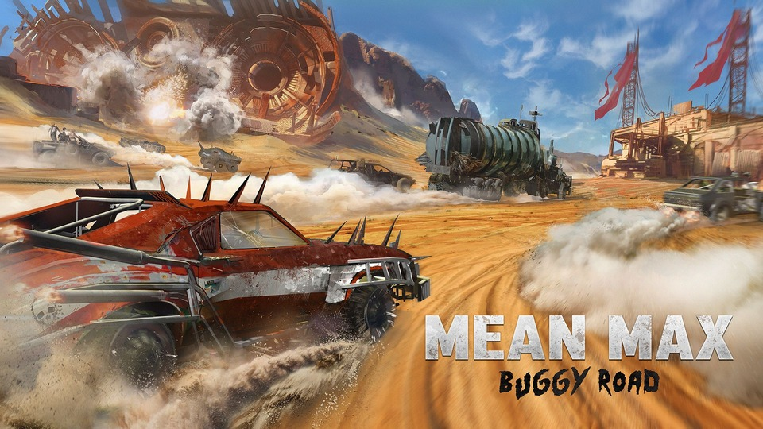

# Solutions to CodinGame Puzzles



The "Solutions to CodinGame Puzzles" project is a comprehensive repository housing solutions to an array of programming challenges sourced from CodinGame, a platform designed to enhance coding skills through interactive challenges. This repository features solutions implemented in Python, C++, Java, and other languages, each neatly organized within files named after the respective challenge. Covering a spectrum of difficulty levels from easy to hard, these solutions tackle diverse topics such as variables, input/output handling, conditions, loops, arrays, graphs, and more. With a focus on efficiency and clarity, the project aims to serve as a valuable resource for developers seeking to sharpen their problem-solving abilities and explore various programming paradigms while enjoying the friendly competition fostered by CodinGame's platform. Additionally, the project provides detailed documentation and adheres to standardized coding practices, ensuring accessibility and ease of use for contributors and users alike.

  [](https://github.com/psf/black)

## Puzzles

### Easy Puzzles
| Title | Solution(s) | Topic(s) |
| :---: | :------: | :------: |
| Onboarding 🛹 | [Python](./puzzles/python3/onboarding), [JavaScript](./puzzles/js/onboarding), [C++](./puzzles/cpp/onboarding) | Variables, Input/Output, Conditions |
| The Descent 🌄 | [Python](./puzzles/python3/the-descent) &starf;, [Kotlin](./puzzles/kotlin/src/the-descent), [TypeScript](./puzzles/ts/the-descent), [C](./puzzles/c/the-descent) | Conditions, Loops |
| Power of Thor 1 ⚡ | [Python](./puzzles/python3/power-of-thor1) &starf;, [Kotlin](./puzzles/kotlin/src/power-of-thor1), [TypeScript](./puzzles/ts/power-of-thor1), [C++](./puzzles/cpp/power-of-thor1.cpp), [Swift](./puzzles/swift/power-of-thor1) | Input/Output, Conditions |
| Temperatures ❄️ | [Python](./puzzles/python3/temperatures) &starf;, [Kotlin](./puzzles/kotlin/src/temperatures), [TypeScript](./puzzles/ts/temperatures), [Ruby](./puzzles/ruby/temperatures) | Conditions, Loops, Arrays |
| Mars Lander 1 🚀 | [Python](./puzzles/python3/mars-lander1), [Kotlin](./puzzles/kotlin/src/mars-lander1), [TypeScript](./puzzles/ts/mars-lander1) &starf;, [C++](./puzzles/cpp/mars-lander1.cpp) | Conditions, Loops |
| ASCII Art 🎨 | [Python](./puzzles/python3/ascii-art), [Kotlin](./puzzles/kotlin/src/ascii-art), [TypeScript](./puzzles/ts/ascii-art), [Ruby](./puzzles/ruby/ascii-art) &starf; | Strings |
| Unary 1️⃣ | [Python](./puzzles/python3/unary), [TypeScript](./puzzles/ts/unary) &starf;, [Haskell](./puzzles/haskell/unary), [C#](./puzzles/cs/unary) | Strings, Encoding |
| MIME Type 🎵 | [Python](./puzzles/python3/mime-type) &starf;, [Kotlin](./puzzles/kotlin/src/mime-type), [TypeScript](./puzzles/ts/mime-type), [C#](./puzzles/cs/mime-type) | Strings, Hash Tables |
| Defibrillators 💖 | [Python](./puzzles/python3/defibrillators) &starf;, [Kotlin](./puzzles/kotlin/src/defibrillators), [TypeScript](./puzzles/ts/defibrillators), [C#](./puzzles/cs/defibrillators) | Strings, Trigonometry |
| Racing Duals 🏁 | [Python](./puzzles/python3/horse-racing-duals) &starf;, [Kotlin](./puzzles/kotlin/src/horse-racing-duals), [JavaScript](./puzzles/js/horse-racing-duals), [Ruby](./puzzles/ruby/horse-racing-duals) | Arrays, Sorting |

### Medium Puzzles
| Title | Solution(s) | Topic(s) |
| :---: | :------: | :------: |
| Shadows of the Knight 1 🦇 | [Python](./puzzles/python3/shadows-knight1) &starf;, [Kotlin](./puzzles/kotlin/src/shadows-knight1), [TypeScript](./puzzles/ts/shadows-knight1/shadows-knight1.ts) | Binary Search, 2D Arrays |
| There is no Spoon 1 🥄 | [Python](./puzzles/python3/there-is-no-spoon1) &starf;, [Kotlin](./puzzles/kotlin/src/there-is-no-spoon1), [TypeScript](./puzzles/ts/there-is-no-spoon1/there-is-no-spoon1.ts), [C++](./puzzles/cpp/there-is-no-spoon1.cpp) | 2D Arrays |
| DFS 1 🌆 | [Python](./puzzles/python3/skynet-revolution1) &starf;, [JavaScript](./puzzles/js/skynet-revolution1.js) | Graphs, BFS |
| Don't Panic 1 🕶️ | [Python](./puzzles/python3/dont-panic1) &starf;, [Kotlin](./puzzles/kotlin/src/dont-panic1), [TypeScript](./puzzles/ts/dont-panic1/dont-panic1.ts) | Conditions |
| War ♥️ ♦️ ♠️ ♣️ | [Python](./puzzles/python3/war) &starf;, [Kotlin](./puzzles/kotlin/src/war), [TypeScript](./puzzles/ts/war/war.ts), [C++](./puzzles/cpp/war.cpp) | Queues, Card Games |
| Stock Exchange Losses 📈 | [Python](./puzzles/python3/stock-exchange) &starf; | Conditions, Loops |
| The Fall 1 💎 | [Python](./puzzles/python3/the-fall1), [JavaScript](./puzzles/js/the-fall1) &starf; | 2D Arrays |
| Network Cabling 🔌 | [Python](./puzzles/python3/network-cabling) | Sorting, Median |
| Conway Sequence 👀 | [Python](./puzzles/python3/conway-sequence), [Kotlin](./puzzles/kotlin/src/conway-sequence), [C#](./puzzles/cs/conway-sequence) | Sequences |
| Telephone Numbers 📱 | [Python](./puzzles/python3/telephone-numbers) &starf; | Tries |
| Dwarfs standing on giants 🏞️ | [Python](./puzzles/python3/dwarfs-giants) &starf;, [TypeScript](./puzzles/ts/dwarfs-giants) | Graphs, Recursion |
| Blunder 1 🍺 | [Python](./puzzles/python3/blunder1) &starf; | 2D Arrays, State Machine, Simulation |
| Scrabble 🔤 | [Python](./puzzles/python3/scrabble) &starf;, [Kotlin](./puzzles/kotlin/src/scrabble), [TypeScript](./puzzles/ts/scrabble/scrabble.ts) | Strings, Hash Tables |
| The Gift 🎁 | [Python](./puzzles/python3/the-gift) | Arrays, Sorting, Greedy algorithms |
| Mayan Calculation 2️⃣0️⃣ | [Python](./puzzles/python3/mayan-calc), [Kotlin](./puzzles/kotlin/src/mayan-calc) &starf;, [Ruby](./puzzles/ruby/mayan-calc) | Strings |

### Hard Puzzles
| Title | Solution(s) | Topic(s) |
| :---: | :------: | :------: |
| The Labyrinth 🌟 | [Python](./puzzles/python3/the-labyrinth) &starf; | 2D Arrays, Graphs, BFS |
| DFS 2 🏙️ | [Python](./puzzles/python3/skynet-revolution2) &starf;, [Kotlin](./puzzles/kotlin/src/skynet-revolution2) | Graphs |
| Vox Codei 1 🎭 | [Python](./puzzles/python3/vox-codei1) &starf;, [C++](./puzzles/cpp/vox-codei1.cpp) | Simulation |
| Super Computer 📅 | [Python](./puzzles/python3/super-computer), [Kotlin](./puzzles/kotlin/src/super-computer) | Sorting, Greedy Algorithms, Scheduling |
| Roller Coaster 🎢 | [Python](./puzzles/python3/roller-coaster) &starf; | Queues, Dynamic Programming, Simulation |
| Surface 🌊 | [Python](./puzzles/python3/surface) &starf;, [Kotlin](./puzzles/kotlin/src/surface) | 2D Arrays, Graphs, Flood Fill |
| CGX Formatter 🎻 | [Python](./puzzles/python3/cgx-formatter) &starf; | Strings, Parsing |
| TAN Network 🚉 | [Python](./puzzles/python3/tan-network) &starf;, [Kotlin](./puzzles/kotlin/src/tan-network) | Graphs, Pathfinding |
| Genome Sequencing 🧬 | [Python](./puzzles/python3/genome-sequencing) &starf; | Strings, Shortest Common Supersequence |
| Blunder 2 🎱 | [Python](./puzzles/python3/blunder2) &starf; | Pathfinding |
| Blunder 3 ⌛ | [Python](./puzzles/python3/blunder3) &starf; | Time Complexity |

## Poetry

```shell
# Installing dependencies
poetry install

# Linting
poetry run ruff check .

# Formatting
poetry run ruff format .
```

## General Tips

To tackle CodinGame puzzles effectively, start by understanding the problem statement thoroughly. Break down complex tasks into smaller, manageable steps. Utilize the provided input/output specifications to design your solution. Leverage appropriate data structures like arrays, graphs, queues, or strings based on the problem requirements. Pay attention to conditions and loops for flow control. For puzzles involving grids or matrices, consider 2D array manipulation techniques. Implement algorithms such as BFS, DFS, binary search, or sorting algorithms as needed. Optimize your code for efficiency, especially in hard puzzles, by employing dynamic programming or greedy algorithms. Test your solutions against sample inputs and edge cases to ensure correctness. Finally, document your code clearly, adhering to standard coding practices. Collaborate with others and explore diverse programming languages to broaden your problem-solving skills.

## Discovering CodinGame: An Exciting Learning Journey

As you start your coding journey on CodinGame, you're stepping into a world of puzzles that'll test your skills in ways you never imagined. From tweaking simple variables to tackling complex graph problems and optimizing dynamic programming, you'll dive into the heart of programming concepts. Armed with Python, C++, or Java, you'll craft solutions to challenges like figuring out temperatures or guiding Thor through electrifying adventures. Whether you're creating ASCII art or navigating the twists of a labyrinth, each task will sharpen your problem-solving skills and broaden your coding knowledge. Every puzzle you conquer adds to a growing library of solutions, building a community of learners and innovators. As you tackle each challenge, you won't just find answers – you'll gain a deeper grasp of algorithms, data structures, and the craft of coding itself. So, dive in, let your creativity loose, and enjoy the endless journey of learning and discovery on CodinGame.
