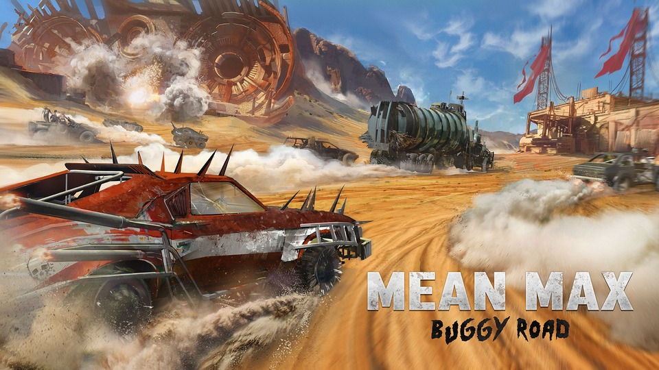

# Solutions to CodinGame Puzzles

The repository contains a number of solutions to programming challenges from [CodinGame](https://www.codingame.com/)
. These solutions are written in various programming languages, including Python, C++, and Java. Each solution is contained in its own file, with a name that describes the challenge it solves.

In addition to the solutions, the repository also includes some other files, such as a README.md file that provides information about the repository and its contents, as well as some configuration files that are specific to CodinGame.

It's worth noting that CodinGame is a website that provides programming challenges and puzzles for developers to solve. The challenges are designed to help developers improve their coding skills by providing them with interesting and engaging problems to solve. The website supports a number of different programming languages, and developers can compete with each other to see who can solve the challenges the fastest and most efficiently.

  

## Puzzles

### Easy Puzzles
| Title | Solution(s) | Topic(s) |
| :---: | :------: | :------: |
| Onboarding 🛹 | [Python](./puzzles/python3/onboarding), [JavaScript](./puzzles/js/onboarding), [C++](./puzzles/cpp/onboarding) | Variables, Input/Output, Conditions |
| The Descent 🌄 | [Python](./puzzles/python3/the-descent) &starf;, [Kotlin](./puzzles/kotlin/src/the-descent), [TypeScript](./puzzles/ts/the-descent), [C](./puzzles/c/the-descent) | Conditions, Loops |
| Power of Thor 1 ⚡ | [Python](./puzzles/python3/power-of-thor1) &starf;, [Kotlin](./puzzles/kotlin/src/power-of-thor1), [TypeScript](./puzzles/ts/power-of-thor1), [C++](./puzzles/cpp/power-of-thor1.cpp), [Swift](./puzzles/swift/power-of-thor1) | Input/Output, Conditions |
| Temperatures ❄️ | [Python](./puzzles/python3/temperatures) &starf;, [Kotlin](./puzzles/kotlin/src/temperatures), [TypeScript](./puzzles/ts/temperatures), [Ruby](./puzzles/ruby/temperatures) | Conditions, Loops, Arrays |
| Mars Lander 1 🚀 | [Python](./puzzles/python3/mars-lander1), [Kotlin](./puzzles/kotlin/src/mars-lander1), [TypeScript](./puzzles/ts/mars-lander1) &starf;, [C++](./puzzles/cpp/mars-lander1.cpp) | Conditions, Loops |
| ASCII Art 🎨 | [Python](./puzzles/python3/ascii-art), [Kotlin](./puzzles/kotlin/src/ascii-art), [TypeScript](./puzzles/ts/ascii-art), [Ruby](./puzzles/ruby/ascii-art) &starf; | Strings |
| Unary 1️⃣ | [Python](./puzzles/python3/unary), [TypeScript](./puzzles/ts/unary) &starf;, [Haskell](./puzzles/haskell/unary), [C#](./puzzles/cs/unary) | Strings, Encoding |
| MIME Type 🎵 | [Python](./puzzles/python3/mime-type) &starf;, [Kotlin](./puzzles/kotlin/src/mime-type), [TypeScript](./puzzles/ts/mime-type), [C#](./puzzles/cs/mime-type) | Strings, Hash Tables |
| Defibrillators 💖 | [Python](./puzzles/python3/defibrillators) &starf;, [Kotlin](./puzzles/kotlin/src/defibrillators), [TypeScript](./puzzles/ts/defibrillators), [C#](./puzzles/cs/defibrillators) | Strings, Trigonometry |
| Racing Duals 🏁 | [Python](./puzzles/python3/horse-racing-duals) &starf;, [Kotlin](./puzzles/kotlin/src/horse-racing-duals), [JavaScript](./puzzles/js/horse-racing-duals), [Ruby](./puzzles/ruby/horse-racing-duals) | Arrays, Sorting |

### Medium Puzzles
| Title | Solution(s) | Topic(s) |
| :---: | :------: | :------: |
| Shadows of the Knight 1 🦇 | [Python](./puzzles/python3/shadows-knight1) &starf;, [Kotlin](./puzzles/kotlin/src/shadows-knight1), [TypeScript](./puzzles/ts/shadows-knight1/shadows-knight1.ts) | Binary Search, 2D Arrays |
| There is no Spoon 1 🥄 | [Python](./puzzles/python3/there-is-no-spoon1) &starf;, [Kotlin](./puzzles/kotlin/src/there-is-no-spoon1), [TypeScript](./puzzles/ts/there-is-no-spoon1/there-is-no-spoon1.ts), [C++](./puzzles/cpp/there-is-no-spoon1.cpp) | 2D Arrays |
| DFS 1 🌆 | [Python](./puzzles/python3/skynet-revolution1) &starf;, [JavaScript](./puzzles/js/skynet-revolution1.js) | Graphs, BFS |
| Don't Panic 1 🕶️ | [Python](./puzzles/python3/dont-panic1) &starf;, [Kotlin](./puzzles/kotlin/src/dont-panic1), [TypeScript](./puzzles/ts/dont-panic1/dont-panic1.ts) | Conditions |
| War ♥️ ♦️ ♠️ ♣️ | [Python](./puzzles/python3/war) &starf;, [Kotlin](./puzzles/kotlin/src/war), [TypeScript](./puzzles/ts/war/war.ts), [C++](./puzzles/cpp/war.cpp) | Queues, Card Games |
| Stock Exchange Losses 📈 | [Python](./puzzles/python3/stock-exchange) &starf; | Conditions, Loops |
| The Fall 1 💎 | [Python](./puzzles/python3/the-fall1), [JavaScript](./puzzles/js/the-fall1) &starf; | 2D Arrays |
| Network Cabling 🔌 | [Python](./puzzles/python3/network-cabling) | Sorting, Median |
| Conway Sequence 👀 | [Python](./puzzles/python3/conway-sequence), [Kotlin](./puzzles/kotlin/src/conway-sequence), [C#](./puzzles/cs/conway-sequence) | Sequences |
| Telephone Numbers 📱 | [Python](./puzzles/python3/telephone-numbers) &starf; | Tries |
| Dwarfs standing on giants 🏞️ | [Python](./puzzles/python3/dwarfs-giants) &starf;, [TypeScript](./puzzles/ts/dwarfs-giants) | Graphs, Recursion |
| Blunder 1 🍺 | [Python](./puzzles/python3/blunder1) &starf; | 2D Arrays, State Machine, Simulation |
| Scrabble 🔤 | [Python](./puzzles/python3/scrabble) &starf;, [Kotlin](./puzzles/kotlin/src/scrabble), [TypeScript](./puzzles/ts/scrabble/scrabble.ts) | Strings, Hash Tables |
| The Gift 🎁 | [Python](./puzzles/python3/the-gift) | Arrays, Sorting, Greedy algorithms |
| Mayan Calculation 2️⃣0️⃣ | [Python](./puzzles/python3/mayan-calc), [Kotlin](./puzzles/kotlin/src/mayan-calc) &starf;, [Ruby](./puzzles/ruby/mayan-calc) | Strings |

### Hard Puzzles
| Title | Solution(s) | Topic(s) |
| :---: | :------: | :------: |
| The Labyrinth 🌟 | [Python](./puzzles/python3/the-labyrinth) &starf; | 2D Arrays, Graphs, BFS |
| DFS 2 🏙️ | [Python](./puzzles/python3/skynet-revolution2) &starf;, [Kotlin](./puzzles/kotlin/src/skynet-revolution2) | Graphs |
| Vox Codei 1 🎭 | [Python](./puzzles/python3/vox-codei1) &starf;, [C++](./puzzles/cpp/vox-codei1.cpp) | Simulation |
| Super Computer 📅 | [Python](./puzzles/python3/super-computer), [Kotlin](./puzzles/kotlin/src/super-computer) | Sorting, Greedy Algorithms, Scheduling |
| Roller Coaster 🎢 | [Python](./puzzles/python3/roller-coaster) &starf; | Queues, Dynamic Programming, Simulation |
| Surface 🌊 | [Python](./puzzles/python3/surface) &starf;, [Kotlin](./puzzles/kotlin/src/surface) | 2D Arrays, Graphs, Flood Fill |
| CGX Formatter 🎻 | [Python](./puzzles/python3/cgx_formatter.py) &starf; | Strings, Parsing |
| TAN Network 🚉 | [Python](./puzzles/python3/tan-network) &starf;, [Kotlin](./puzzles/kotlin/src/tan-network) | Graphs, Pathfinding |
| Genome Sequencing 🧬 | [Python](./puzzles/python3/genome-sequencing) &starf; | Strings, Shortest Common Supersequence |
| Blunder 2 🎱 | [Python](./puzzles/python3/blunder2) &starf; | Pathfinding |
| Blunder 3 ⌛ | [Python](./puzzles/python3/blunder3) &starf; | Time Complexity |
